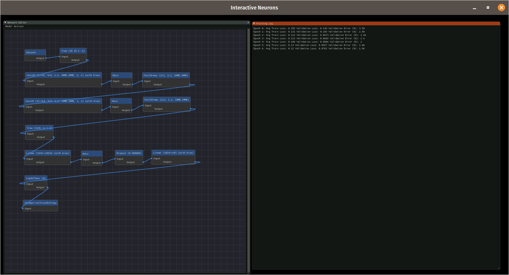

# interactive-neurons

**Author**: Simon Liu - [`simonl2@illinois.edu`](mailto:simonl2@illinois.edu)

interactive-neurons is an interactive GUI that allows you to design and train 
simple convolutional neural networks. Through the GUI, you can tweak the 
network architecture, including features such as layers, connections, 
and activation functions. You can also customize training parameters such as 
the learning rate, training time, and optimizers. 

*Build Requirements*: 
1. CMake
2. [Cinder 0.9.3dev](https://github.com/imonlius/imnodes)
3. [imnodes CinderBlock](https://github.com/imonlius/imnodes)
4. [flashlight](https://github.com/facebookresearch/flashlight)

*Build Instructions*:
1. Clone Cinder 0.9.3dev with instructions from 
https://github.com/cinder/Cinder. Refer to this directory as `$CINDER`.
2. Clone [imnodes CinderBlock repository](https://github.com/imonlius/imnodes)
into `$CINDER/blocks`. 
3. Install [flashlight](https://github.com/facebookresearch/flashlight) library
and any requirements.
4. Create a subdirectory `$CINDER/projects`. Clone this repository 
into the subdirectory.
5. Build Cinder using CMake.
6. Build this project using CMake.
7. Download and extract [MNIST data files](http://yann.lecun.com/exdb/mnist/)
into `$CINDER/projects/final-project-imonlius/assets/mnist`.

*Usage*: 

1. Build and run cinder-interactive-neurons target to run interactive-neurons.
2. Use Network Editor window to design model architecture. Right click to open
menu to add layer nodes and use mouse to drag links between nodes.
3. Use Train Model under Menu to begin model training configuration. Training log
and/or exceptions will appear in the Log window. 